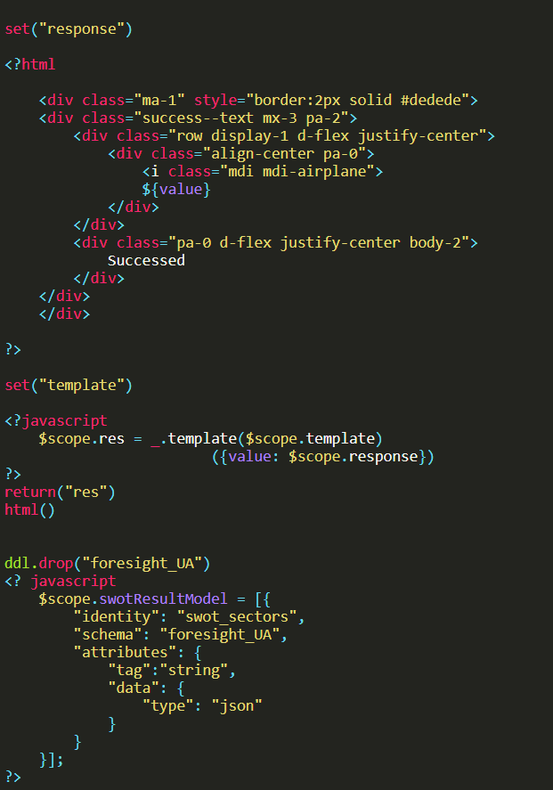
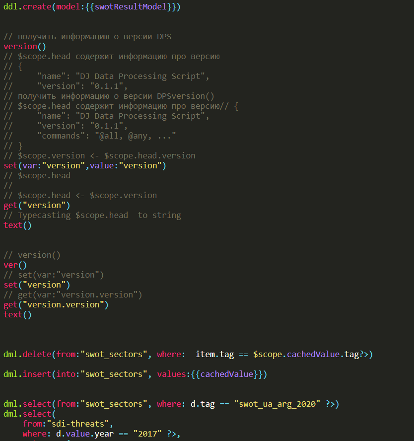

# Підсвітка синтаксису DPS


## Для початку роботи необхідно завантажити бібліотеку Highlight.js.
Посилання на бібліотеку:
https://highlightjs.org/

## Використання

Перед початком роботи необзідно додати бібліотеку Highlight.js до вашої веб-сторінки.

### Статична веб-сторінка або ж просте використання

Просто завантажте модуль з каталогу `dist`після завантаження Highlight.js.

```html
<script type="text/javascript" src="/path/to/highlight.min.js"></script>
<script type="text/javascript" src="/path/to/my_highlighter.min.js"></script>
<script type="text/javascript">
  hljs.highlightAll();
</script>
```
Приклад роботи хайлайтера:




Автор: Охочий Ростислав ІВ-91 ohochyi2002@gmail.com
